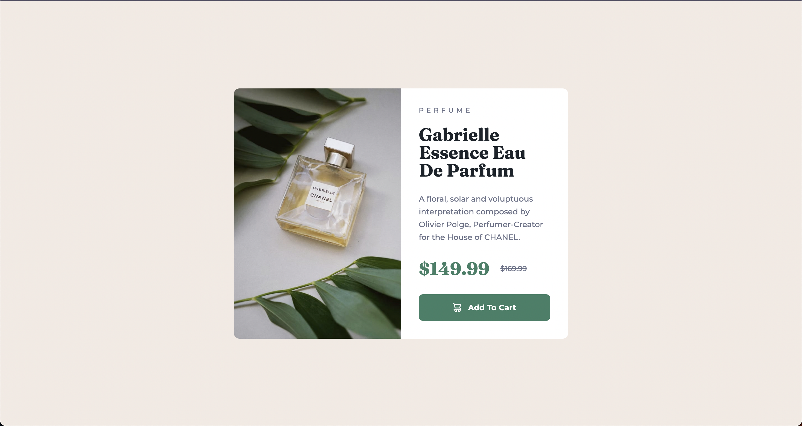

# Frontend Mentor - Product preview card component solution

This is a solution to the [Product preview card component challenge on Frontend Mentor](https://www.frontendmentor.io/challenges/product-preview-card-component-GO7UmttRfa). Frontend Mentor challenges help you improve your coding skills by building realistic projects. 

## Table of contents

- [Overview](#overview)
  - [The challenge](#the-challenge)
  - [Screenshot](#screenshot)
  - [Links](#links)
- [My process](#my-process)
  - [Built with](#built-with)
  - [What I learned](#what-i-learned)
  - [Continued development](#continued-development)
  - [Useful resources](#useful-resources)
- [Author](#author)

**Note: Delete this note and update the table of contents based on what sections you keep.**

## Overview

### The challenge

Users should be able to:

- View the optimal layout depending on their device's screen size
- See hover and focus states for interactive elements

### Screenshot

### Links

- Solution URL: [GitHub](https://github.com/im-voracity/frontendmentor-card-component)
- Live Site URL: [Vercel](https://frontendmentor-card-component-47xz2qrpo-im-voracity.vercel.app/)

## My process

### Built with

- Flexbox
- CSS Grid
- Mobile-first workflow
- [Vue.js](https://vuejs.org/) - JS Framework

### What I learned

This was my first project using Vue.js, so i just learned how to do everything 😅

### Useful resources

- [Using images in Vue.js](https://stackoverflow.com/questions/45116796/how-to-import-and-use-image-in-a-vue-single-file-component) - I struggled a bit with the images in components, here i found the solution i used.

## Author

- Website - [Matheus Tenório](https://matheustenorio.com)
- Frontend Mentor - [@im-voracity](https://www.frontendmentor.io/profile/im-voracity)
- Twitter - [@mathtenorio.dev](https://twitter.com/mathtenorio_dev)
- Instagram - [@matt.tenorio](https://instagram.com/matt.tenorio)
